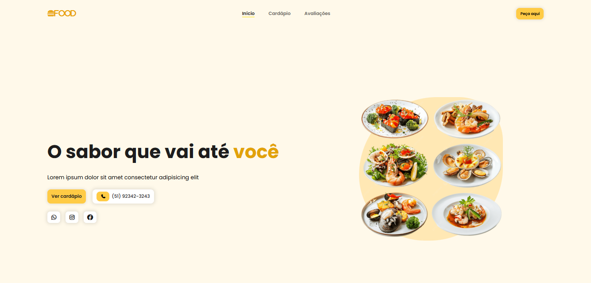

# Food Landing Page

Landing page responsiva para um restaurante de comida fast-food, focada em apresentação de cardápio e conversão.

## Sobre
Aplicação web simples de uma página para um restaurante de comida saudável. Projeto ideal para praticar estruturação de seções (Início, Cardápio e Depoimentos), estilização responsiva com CSS.
### Imagens do projeto:

### Demo
Acesse a demo ao vivo aqui: [Link para Demo](https://foodrestaurantepage.netlify.app)

## Tecnologias
- HTML5
- CSS3 
- jQuery
- Font Awesome (via CDN)
- Google Fonts (via importação CSS)

## Como Usar
Opção 1 — Abrir diretamente
- Baixe/clones este repositório.
- Abra o arquivo index.html no navegador.

Opção 2 — VS Code (Live Server)
- Instale a extensão Live Server
- Clique em  Go Live dentro do index.html

## Estrutura
- index.html: marcação das seções e estrutura semântica
- styles: pasta com os estilos e layout responsivo de cada seção
    - styles.css: estilos globais e reset
    - header.css: estilos do cabeçalho e menu
    - home.css: estilos da seção inicial
    - menu.css: estilos da seção de cardápio
    - testimonials.css: estilos da seção de depoimentos
    - footer.css: estilos do rodapé
- javascript: pasta com os arquivos javascript
    - script.js: funcionalidade de menu mobile
- assets: pasta com imagens e ícones usados no projeto

## Scripts
Este projeto não possui package.json nem scripts de npm/yarn; é um app estático e pode ser executado diretamente no navegador.

## Autor
- Nome: João Vitor - Web Dev
- GitHub: https://github.com/joaovitor-webdev
- Portfólio: https://joaovitor-webdev.netlify.app
